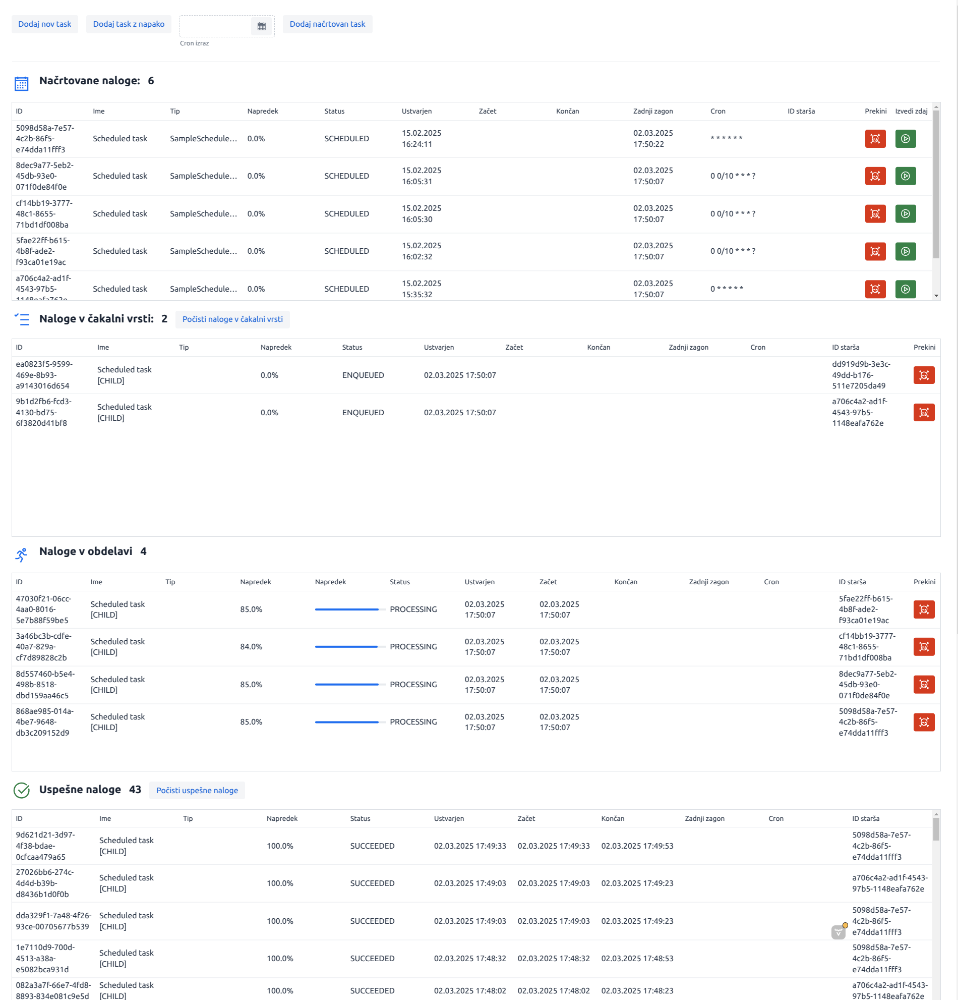

# Taskomir

**Taskomir** is a Java-based simple background task manager designed to schedule and monitor long-running processes.
It provides a flexible, extensible core library and a demo application showcasing how to integrate scheduling,
progress tracking, and a Vaadin-based UI.
You can use Taskomir Dashboard Ui component in your own application. Just add the dependency to your project and use it. Check the demo!

I really like Vaadin and I wanted to create a simple task manager that can be used in any Java application.

For persistance, Mongo is used. If you don't have Mongo installed, you can use the provided docker-compose file to start it.
Of course, you can use any other database, just implement the TaskRepository interface.


## Key Features

- **Core Library** (`taskomir-core`):
    - Manages task lifecycle: `ENQUEUED`, `PROCESSING`, `SUCCEEDED`, `FAILED`, and `DELETED`.
    - Cron-based scheduling for recurring tasks.
    - Repository layer with MongoDB (or JPA if needed).
    - Progress tracking via a functional `ProgressTask` interface.
    - Extensible architecture for other custom tasks.

- **Demo Application** (`taskomir-demo`):
    - Spring Boot + Vaadin UI to visualize running and completed tasks.
    - Displays real-time progress updates.
    - Allows cancellation, deletion, and filtering by task status.
    - Serves as a reference to show how Taskomir can be integrated in a full-stack setup.

## Screenshots




## TODO

- [ ] Add tests
- [ ] Add more features
- [ ] Add more documentation
- [ ] Add more tests
- [ ] Deploy to Maven  Central Repository

## Structure

    taskomir-parent/      (aggregator POM for both modules, includes plugin/dependency management)
    ├─ taskomir-core/     (core logic, background tasks, scheduling, etc.)
    └─ taskomir-demo/     (demo UI app using Spring Boot and Vaadin)

- **taskomir-parent**: Defines shared properties, plugin versions (e.g. for Spring Boot and Vaadin), and modules.
- **taskomir-core**: A library JAR that contains the main business logic and scheduling mechanism.
- **taskomir-demo**: A Vaadin-based web application showcasing how to utilize `taskomir-core`.

## Usage

1. **Clone the Repository**
   ```bash
   git clone https://github.com/urkl/taskomir.git
   cd taskomir
   ```

2. **Build**
   ```bash
   mvn clean install
   ```
    - This compiles both the core library and the demo application.

3. **Run the Demo**
   ```bash
   cd taskomir-demo
   mvn spring-boot:run
   ```
    - Access the Vaadin UI at `http://localhost:8888`.

4. **Integrate the Core Library**
    - Include the published `taskomir-core` artifact in your Maven (or Gradle) project, and follow the usage examples to enqueue tasks, manage schedules, etc.

## Build

### Start new release
   ```bash
   mvn gitflow:release-start
   ```
### Deploy artifacts
   ```bash
   
   mvn clean deploy -Pproduction
   
   ```
### Finish release
   ```bash
   
   
   mvn gitflow:release-finish
   ```
## Contributing

Contributions and pull requests are welcome! To contribute:

1. Fork the repo.
2. Create a feature branch.
3. Open a pull request against the `develop` branch.

## License

Licensed under the [MIT](LICENSE).  
Please review the license file for more information.

---

**Author**: Uroš Kristan

For any questions or feedback, feel free to open an issue or contact the author directly.  